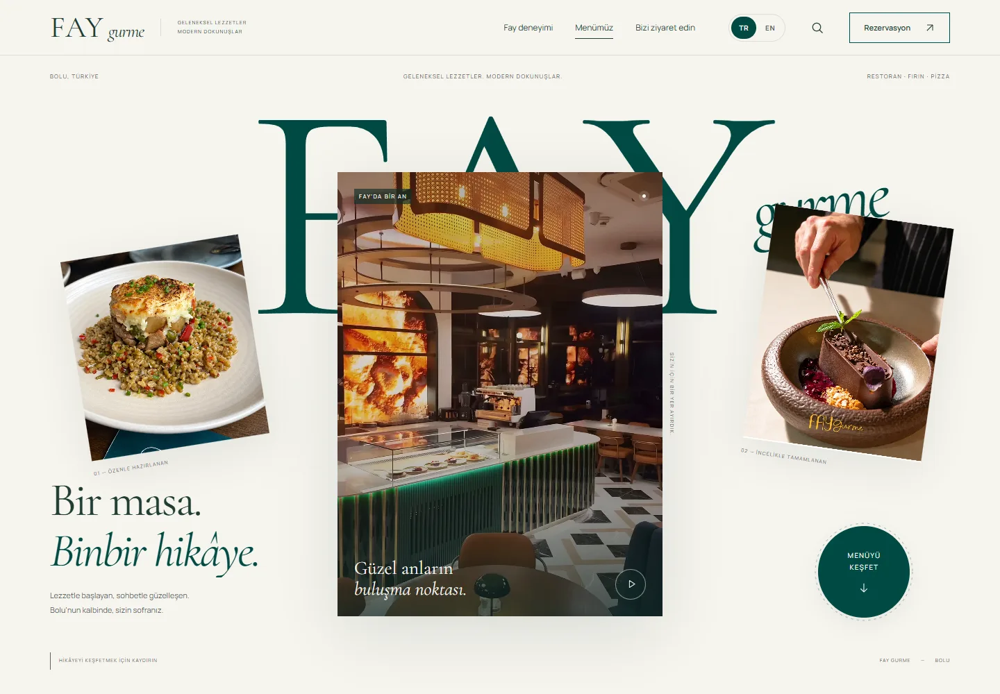
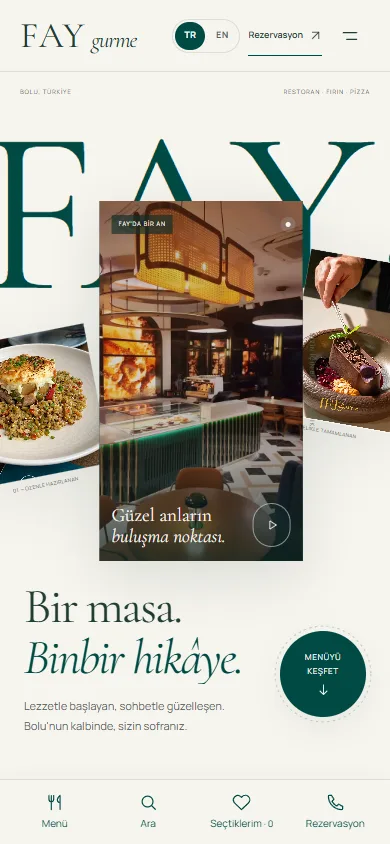

# Fay Gurme — Digital Menu

A cinematic, bilingual digital menu for Fay Gurme, a restaurant in Bolu, Türkiye.
It pairs a scroll-driven editorial opening with a fast, accessible QR menu of
**23 categories and 198 dishes**, built with plain HTML, CSS and JavaScript,
with no framework and no runtime dependencies.

<p align="center">
  
  &nbsp;
  
</p>

> **Note:** this is an independent concept project. It is not affiliated with or
> endorsed by the restaurant. Menu content, photography, video and branding
> belong to their owners and are included for demonstration only. See [License](#license).

## Highlights

- **Scroll storytelling.** Oversized FAY lettering, a portrait film and layered
  photography dissolve into a dark green scene, followed by three food chapters.
  Built on GSAP ScrollTrigger over *native* scrolling, never hijacked.
- **A real menu, not a mock-up.** Turkish-aware search across names, descriptions
  and categories, price and name sorting, pagination, allergen and dietary labels,
  shareable product links and a "saved" list stored on the device.
- **Turkish / English.** Every UI string and menu item is translated. A coverage
  check fails the build if anything is missing.
- **Mobile first.** A compact opening, swipeable chapters, a bottom action dock and a
  category drawer. Tested down to 320px.
- **Accessible.** Native `<dialog>` focus handling, full keyboard support, 44px
  targets, 4.5:1 contrast and a complete `prefers-reduced-motion` fallback. No
  axe-core WCAG 2.1 AA violations.
- **Considerate media.** Videos play only while visible and can always be paused. The
  hero film and all 197 product photos were restored locally with Real-ESRGAN,
  with before/after comparison pages to back it up.
- **Social previews.** Branded Open Graph cards, plus separate share URLs so
  messaging apps fetch a fresh preview.

## Tech stack

| Area | Choice |
| --- | --- |
| UI | Semantic HTML, modern CSS (custom properties, `:has()`, `svh` units), vanilla ES modules |
| Motion | [GSAP 3.13](https://gsap.com) + ScrollTrigger, self-hosted |
| Type | Cormorant Garamond and Manrope, self-hosted WOFF2 |
| Dev server | Dependency-free Node.js static server with HTTP range support for video |
| Build | A Node script that validates assets and copies them into a static `dist/` |
| Hosting | Vercel (`vercel.json`), or any static host |
| Tooling | Playwright + axe-core for QA; Python, FFmpeg and Real-ESRGAN for media restoration |

## Getting started

Requires **Node.js 20+**. There is nothing to install.

```bash
npm run dev      # http://localhost:4173
```

| URL | Page |
| --- | --- |
| `/` | Opening experience and menu |
| `/menu` | Goes straight to the menu (for table QR codes) |
| `/media-review.html` | Before/after photo restoration comparison |
| `/video-review.html` | Synchronised before/after video comparison |

Use a different port with `PORT=4174 npm run dev`.

## Scripts

| Command | Description |
| --- | --- |
| `npm run dev` | Start the local server |
| `npm run check` | Syntax-check all JavaScript and verify i18n coverage |
| `npm run build` | Validate every referenced asset and produce `dist/` |
| `npm run format` | Format JS and CSS with Prettier |
| `npm run qa:*` | Browser QA suites (`audit`, `a11y`, `behavior`, `experience`, `video-review`). See [docs/QUALITY.md](docs/QUALITY.md) |

## Project structure

```
.
├── public/                  # Everything that is served
│   ├── index.html           # Opening experience + menu
│   ├── media-review.html    # Photo before/after tool
│   ├── video-review.html    # Video before/after tool
│   ├── css/                 # styles (menu), experience (scroll scenes), fonts, review pages
│   ├── js/                  # app (menu), experience (scroll story), review pages
│   ├── i18n/                # TR/EN dictionary and language runtime
│   ├── data/                # menu.json and the restoration manifest
│   ├── media/               # Photos and video (originals + restored versions)
│   ├── fonts/               # Self-hosted fonts and their OFL licenses
│   └── vendor/              # GSAP + ScrollTrigger
├── scripts/                 # Build, data, media restoration and QA tooling
├── docs/                    # Design system, quality report, screenshots
├── server.mjs               # Local dev server
└── vercel.json              # Static hosting config, rewrites and headers
```

Menu data flows in one direction: `scripts/data/extract.py` turns an archived copy
of the public menu into `public/data/menu.json`, English text is merged in by
`scripts/data/apply-menu-translations.mjs`, and the front end renders straight from
that JSON. See [scripts/README.md](scripts/README.md) for every script.

## Deployment

The repository deploys to Vercel as is. `vercel.json` sets the build command,
the `dist` output, clean URLs, the `/menu` rewrite and cache/security headers, and
no environment variables are needed. Any other static host works too: serve the
`dist/` folder after `npm run build`.

The pages carry `noindex, nofollow` on purpose. Remove it before a real launch.

## Documentation

- [docs/DESIGN.md](docs/DESIGN.md): visual thesis, interaction model, design tokens and components
- [docs/QUALITY.md](docs/QUALITY.md): automated checks and latest results
- [docs/design-dna.json](docs/design-dna.json): the design system in machine-readable form
- [scripts/README.md](scripts/README.md): tooling reference

## Media restoration

The source photos were small (~512px) and the hero film was 720p. All
restoration ran locally with no cloud service:

- **Hero film:** 720 × 1280 → 1080 × 1920 with Real-ESRGAN x4plus, 744 frames,
  blended 75/25 with the source to avoid a plastic look. Timing, colour metadata
  and bit-identical audio are verified by script.
- **Photos:** 12 featured shots were restored by hand. The other 185 use Real-ESRGAN
  with a 72/28 restored/source blend, capped at 1400px.

AI restoration reinterprets fine texture and cannot recover detail that was never
captured. The original files are kept next to every restored version, and the
comparison pages make the difference visible.

## License

The **source code** is released under the [MIT License](LICENSE).

The restaurant's **menu content, photographs, videos, logo and name** are the
property of their owners. They are not covered by the MIT License and may not be
reused. GSAP is used under the [GSAP Standard License](https://gsap.com/standard-license).
Cormorant Garamond and Manrope are licensed under the SIL Open Font License
(see `public/fonts/`).
